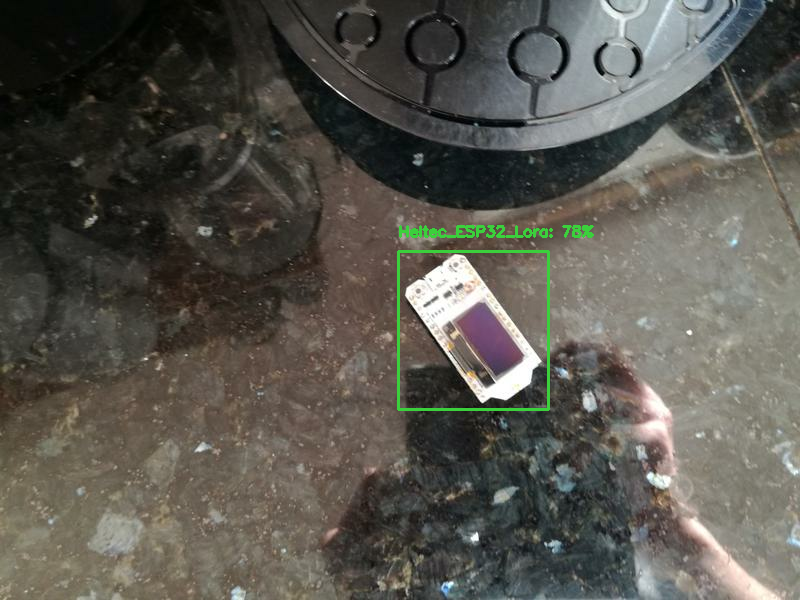
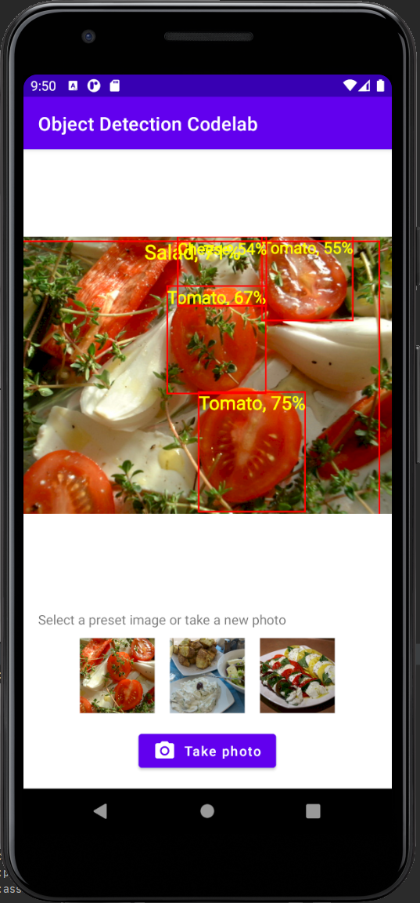

# TFLite Object Detection with TFLite Model Maker



The TensorFlow Lite Model Maker library is a high-level library that simplifies the process of training a TensorFlow Lite model using a custom dataset. It uses transfer learning to reduce the amount of training data required and shorten the training time. This guide walks you through creating a custom object detector and deploying it on Android. The guide is heavily based on the [Object Detection with TensorFlow Lite Model Maker page](https://www.tensorflow.org/lite/tutorials/model_maker_object_detection) from the Tensorflow Lite documentation.

## Prerequisites

### Install required packages

```
pip install -q tflite-model-maker
pip install -q pycocotools
```

Import the required packages.

```python
import numpy as np
import os

from tflite_model_maker.config import ExportFormat
from tflite_model_maker import model_spec
from tflite_model_maker import object_detector

import tensorflow as tf
assert tf.__version__.startswith('2')

tf.get_logger().setLevel('ERROR')
from absl import logging
logging.set_verbosity(logging.ERROR)
```

### Gathering and labeling data

Before you can start creating your own custom object detector, you'll have to prepare a dataset. The Tensorflow Lite Model Maker supports two data formats - [CSV](https://cloud.google.com/vision/automl/object-detection/docs/csv-format) and [PASCAL VOC](https://towardsdatascience.com/coco-data-format-for-object-detection-a4c5eaf518c5#:~:text=Pascal%20VOC%20is%20an%20XML,for%20training%2C%20testing%20and%20validation). Data in CSV format can be loaded with [`object_detector.DataLoader.from_csv`](https://www.tensorflow.org/lite/api_docs/python/tflite_model_maker/object_detector/DataLoader#from_csv) and data in PASCAL VOC format can be loaded using the [`object_detector.DataLoader.from_pascal_voc`](https://www.tensorflow.org/lite/api_docs/python/tflite_model_maker/object_detector/DataLoader#from_pascal_voc) method.

To create a dataset in LabelImg format, I recommend using [labelImg](https://github.com/tzutalin/labelImg), an open-source graphical image annotation tool. 


If you don't want to create your own dataset, you can find lots of datasets on places like [Kaggle](https://www.kaggle.com/datasets?tags=13207-Computer+Vision) or [Roboflow](https://public.roboflow.com/).

## Train custom object detection model

### Step 1. Choose an object detection model architecture.

Tensorflow Lite Model Maker currently supports 5 different object detection models (EfficientDet-Lite[0-4]). All of them are derived from the [EfficientDet](https://arxiv.org/abs/1911.09070) architecture. The main differences between the models are their size and latency.

| Model architecture | Size(MB)* | Latency(ms)** | Average Precision*** |
|--------------------|-----------|---------------|----------------------|
| EfficientDet-Lite0 | 4.4       | 37            | 25.69%               |
| EfficientDet-Lite1 | 5.8       | 49            | 30.55%               |
| EfficientDet-Lite2 | 7.2       | 69            | 33.97%               |
| EfficientDet-Lite3 | 11.4      | 116           | 37.70%               |
| EfficientDet-Lite4 | 19.9      | 260           | 41.96%               |

<i> * Size of the integer quantized models. <br/>
** Latency measured on Pixel 4 using 4 threads on CPU. <br/>
*** Average Precision is the mAP (mean Average Precision) on the COCO 2017 validation dataset.
</i>

```python
spec = model_spec.get('efficientdet_lite0')
```

### Step 2. Load the dataset.

If your dataset is in CSV format, use the [`object_detector.DataLoader.from_csv`](https://www.tensorflow.org/lite/api_docs/python/tflite_model_maker/object_detector/DataLoader#from_csv) method to load the data and to split it into training, validation, and test sets.

```python
train_data, validation_data, test_data = object_detector.DataLoader.from_csv('<path-to-csv-file>')
```

If you labeled your data in Pascal VOC format, use the  [`object_detector.DataLoader.from_pascal_voc`](https://www.tensorflow.org/lite/api_docs/python/tflite_model_maker/object_detector/DataLoader#from_pascal_voc) method to load the data. You need to pass the method the `image_dir`, `annotations_dir`, and `label_map`. For more information, check out [the documentation](https://www.tensorflow.org/lite/api_docs/python/tflite_model_maker/object_detector/DataLoader#from_pascal_voc).

```python
dataloader = object_detector.DataLoader.from_pascal_voc(image_dir, annotations_dir, label_map={1: "person", 2: "notperson"})
```

The `from_pascal_voc` method doesn't automatically split the data into a training, validation, and test set. For this the `tflite_model_maker.object_detector.DataLoader` provides the `split` method, allowing you to split a dataset into two sub-datasets with the given fraction. However, this method didn't work for me, and I already [reported the error](https://discuss.tensorflow.org/t/attributeerror-nonetype-object-has-no-attribute-take/2039). Therefore until the error is resolved, I recommend splitting the data by hand. An example of this can be seen in the [Chess Piece detection](Train_custom_chess_piece_detector_with_TFLite_Model_Maker.ipynb) example.

```python
# split data into training and testing set
import os, random, shutil

os.mkdir('chess-detection/train')
os.mkdir('chess-detection/test')

image_paths = os.listdir('chess-detection/images')
random.shuffle(image_paths)

for i, image_path in enumerate(image_paths):
  if i < int(len(image_paths) * 0.8):
    shutil.copy(f'chess-detection/images/{image_path}', 'chess-detection/train')
    shutil.copy(f'chess-detection/annotations/{image_path.replace("JPG", "xml")}', 'chess-detection/train')
  else:
    shutil.copy(f'chess-detection/images/{image_path}', 'chess-detection/test')
    shutil.copy(f'chess-detection/annotations/{image_path.replace("JPG", "xml")}', 'chess-detection/test')
```

### Step 3. Train the TensorFlow model with the training data.

After loading the data, the Tensorflow model can be trained using the `object_detector.create` method. The `create` method is the driver function that the Model Maker library uses to create models. The `create` method:
1. Creates the model for the object detection according to `model_spec`
2. Trains the model. By default, the hyperparameters inside the `model_spec` are used, but they can be overwritten by passing the hyperparameters as function arguments.

```python
model = object_detector.create(train_data, model_spec=spec, epochs=50, batch_size=8, train_whole_model=True, validation_data=validation_data)
```

Example output:

```
Epoch 1/50
21/21 [==============================] - 110s 2s/step - det_loss: 1.7648 - cls_loss: 1.1449 - box_loss: 0.0124 - reg_l2_loss: 0.0764 - loss: 1.8412 - learning_rate: 0.0090 - gradient_norm: 0.7164 - val_det_loss: 1.6857 - val_cls_loss: 1.1173 - val_box_loss: 0.0114 - val_reg_l2_loss: 0.0764 - val_loss: 1.7621
Epoch 2/50
21/21 [==============================] - 29s 1s/step - det_loss: 1.6056 - cls_loss: 1.0826 - box_loss: 0.0105 - reg_l2_loss: 0.0764 - loss: 1.6820 - learning_rate: 0.0100 - gradient_norm: 0.9471 - val_det_loss: 1.5332 - val_cls_loss: 1.0065 - val_box_loss: 0.0105 - val_reg_l2_loss: 0.0764 - val_loss: 1.6095
Epoch 3/50
21/21 [==============================] - 33s 2s/step - det_loss: 1.3830 - cls_loss: 0.9211 - box_loss: 0.0092 - reg_l2_loss: 0.0764 - loss: 1.4594 - learning_rate: 0.0099 - gradient_norm: 1.9618 - val_det_loss: 1.3218 - val_cls_loss: 0.8212 - val_box_loss: 0.0100 - val_reg_l2_loss: 0.0764 - val_loss: 1.3982
Epoch 4/50
21/21 [==============================] - 31s 2s/step - det_loss: 1.1782 - cls_loss: 0.7901 - box_loss: 0.0078 - reg_l2_loss: 0.0764 - loss: 1.2546 - learning_rate: 0.0099 - gradient_norm: 2.1614 - val_det_loss: 1.1834 - val_cls_loss: 0.7156 - val_box_loss: 0.0094 - val_reg_l2_loss: 0.0764 - val_loss: 1.2598
Epoch 5/50
21/21 [==============================] - 33s 2s/step - det_loss: 1.0756 - cls_loss: 0.7167 - box_loss: 0.0072 - reg_l2_loss: 0.0764 - loss: 1.1520 - learning_rate: 0.0098 - gradient_norm: 2.1485 - val_det_loss: 1.1105 - val_cls_loss: 0.6764 - val_box_loss: 0.0087 - val_reg_l2_loss: 0.0764 - val_loss: 1.1869
Epoch 6/50
21/21 [==============================] - 30s 1s/step - det_loss: 1.0091 - cls_loss: 0.6841 - box_loss: 0.0065 - reg_l2_loss: 0.0764 - loss: 1.0856 - learning_rate: 0.0097 - gradient_norm: 2.1970 - val_det_loss: 1.0964 - val_cls_loss: 0.6617 - val_box_loss: 0.0087 - val_reg_l2_loss: 0.0764 - val_loss: 1.1729
Epoch 7/50
21/21 [==============================] - 33s 2s/step - det_loss: 0.9230 - cls_loss: 0.6264 - box_loss: 0.0059 - reg_l2_loss: 0.0764 - loss: 0.9995 - learning_rate: 0.0096 - gradient_norm: 2.2962 - val_det_loss: 0.9999 - val_cls_loss: 0.6122 - val_box_loss: 0.0078 - val_reg_l2_loss: 0.0765 - val_loss: 1.0763
Epoch 8/50
21/21 [==============================] - 31s 1s/step - det_loss: 0.9043 - cls_loss: 0.6087 - box_loss: 0.0059 - reg_l2_loss: 0.0765 - loss: 0.9807 - learning_rate: 0.0094 - gradient_norm: 2.2009 - val_det_loss: 0.9992 - val_cls_loss: 0.6201 - val_box_loss: 0.0076 - val_reg_l2_loss: 0.0765 - val_loss: 1.0756
Epoch 9/50
21/21 [==============================] - 32s 2s/step - det_loss: 0.8622 - cls_loss: 0.5827 - box_loss: 0.0056 - reg_l2_loss: 0.0765 - loss: 0.9386 - learning_rate: 0.0093 - gradient_norm: 2.3275 - val_det_loss: 0.9385 - val_cls_loss: 0.5811 - val_box_loss: 0.0071 - val_reg_l2_loss: 0.0765 - val_loss: 1.0150
Epoch 10/50
21/21 [==============================] - 31s 1s/step - det_loss: 0.8461 - cls_loss: 0.5696 - box_loss: 0.0055 - reg_l2_loss: 0.0765 - loss: 0.9226 - learning_rate: 0.0091 - gradient_norm: 2.3217 - val_det_loss: 0.9469 - val_cls_loss: 0.5861 - val_box_loss: 0.0072 - val_reg_l2_loss: 0.0765 - val_loss: 1.0234
...
```

### Step 4. Evaluate the model with the test data.

After training the object detection model using the images in the training dataset, the model can be evaluated on the validation or test data.

```python
model.evaluate(test_data)
```

or

```python
model.evaluate(validation_data)
```

Output example:

```
{'AP': 0.9129471,
 'AP50': 1.0,
 'AP75': 1.0,
 'AP_/Arduino_Nano': 0.80178857,
 'AP_/ESP8266': 1.0,
 'AP_/Heltec_ESP32_Lora': 0.85,
 'AP_/Raspberry_Pi_3': 1.0,
 'APl': 0.9130256,
 'APm': -1.0,
 'APs': -1.0,
 'ARl': 0.9375,
 'ARm': -1.0,
 'ARmax1': 0.9125,
 'ARmax10': 0.925,
 'ARmax100': 0.9375,
 'ARs': -1.0}
```

### Step 5. Export as a TensorFlow Lite model.

Currently, the Tensorflow Lite Model Maker allows you to export the object detection model in TFLITE and [SAVED_MODEL](https://www.tensorflow.org/guide/saved_model) format. By default, the `export` method exports the model to the Tensorflow Lite format and performs full integer quantization on it (`model.export(export_dir='.')`), but you can also choose to [export the model in another format](https://www.tensorflow.org/lite/tutorials/model_maker_object_detection#export_to_different_formats) or [change the quantization type](https://www.tensorflow.org/lite/tutorials/model_maker_object_detection#customize_post-training_quantization_on_the_tensorflow_lite_model).

### Step 6. Evaluate the TensorFlow Lite model.

After converting the model to Tensorflow Lite, it's useful to reevaluate the model as there are several factors when exporting that could have affected the accuracy, including:
* Quantization
* TFLITE using global [non-max suppression (NMS)](https://www.coursera.org/lecture/convolutional-neural-networks/non-max-suppression-dvrjH) instead of per-class non-max suppression (NMS).

```python
model.evaluate_tflite('model.tflite', test_data)
```

Output example:
```
{'AP': 0.8691832,
 'AP50': 1.0,
 'AP75': 1.0,
 'AP_/Arduino_Nano': 0.8009901,
 'AP_/ESP8266': 0.92524755,
 'AP_/Heltec_ESP32_Lora': 0.85049504,
 'AP_/Raspberry_Pi_3': 0.9,
 'APl': 0.8691832,
 'APm': -1.0,
 'APs': -1.0,
 'ARl': 0.8875,
 'ARm': -1.0,
 'ARmax1': 0.8875,
 'ARmax10': 0.8875,
 'ARmax100': 0.8875,
 'ARs': -1.0}
```

## (Optional) Compile for the Edge TPU

### Step 1. Install the EdgeTPU Compiler

```
curl https://packages.cloud.google.com/apt/doc/apt-key.gpg | sudo apt-key add -

echo "deb https://packages.cloud.google.com/apt coral-edgetpu-stable main" | sudo tee /etc/apt/sources.list.d/coral-edgetpu.list

sudo apt-get update

sudo apt-get install edgetpu-compiler
```

### Step 2. Select number of Edge TPUs, Compile

The EdgeTPU has 8MB of SRAM for caching model parameters ([more info](https://coral.ai/docs/edgetpu/compiler/#parameter-data-caching)). This means that for models larger than 8MB, inference time will be increased to transfer over model parameters. One way to avoid this is [Model Pipelining](https://coral.ai/docs/edgetpu/pipeline/) - splitting the model into segments that can have a dedicated EdgeTPU. This can significantly improve latency.

The below table can be used as a reference for the number of Edge TPUs to use - the larger models will not compile for a single TPU as the intermediate tensors can't fit in on-chip memory.

| Model architecture  | Minimum TPUs | Recommended TPUs |
|        :---:        |    :---:     |      :---:       |
| EfficientDet-Lite0  | 1            | 1                |
| EfficientDet-Lite1  | 1            | 1                |
| EfficientDet-Lite2  | 1            | 2                |
| EfficientDet-Lite3  | 2            | 2                |
| EfficientDet-Lite4  | 2            | 3                |

```
edgetpu_compiler model.tflite --num_segments=1
```

## (Optional) Test the TFLite model on your image

### Load the trained TFLite model and define some visualization functions:

<details>
<summary>Toggle code</summary>

```python
import cv2

from PIL import Image

model_path = 'model.tflite'

# Load the labels into a list
classes = ['???'] * model.model_spec.config.num_classes
label_map = model.model_spec.config.label_map
for label_id, label_name in label_map.as_dict().items():
  classes[label_id-1] = label_name

# Define a list of colors for visualization
COLORS = np.random.randint(0, 255, size=(len(classes), 3), dtype=np.uint8)

def preprocess_image(image_path, input_size):
  """Preprocess the input image to feed to the TFLite model"""
  img = tf.io.read_file(image_path)
  img = tf.io.decode_image(img, channels=3)
  img = tf.image.convert_image_dtype(img, tf.uint8)
  original_image = img
  resized_img = tf.image.resize(img, input_size)
  resized_img = resized_img[tf.newaxis, :]
  return resized_img, original_image


def set_input_tensor(interpreter, image):
  """Set the input tensor."""
  tensor_index = interpreter.get_input_details()[0]['index']
  input_tensor = interpreter.tensor(tensor_index)()[0]
  input_tensor[:, :] = image


def get_output_tensor(interpreter, index):
  """Retur the output tensor at the given index."""
  output_details = interpreter.get_output_details()[index]
  tensor = np.squeeze(interpreter.get_tensor(output_details['index']))
  return tensor


def detect_objects(interpreter, image, threshold):
  """Returns a list of detection results, each a dictionary of object info."""
  # Feed the input image to the model
  set_input_tensor(interpreter, image)
  interpreter.invoke()

  # Get all outputs from the model
  boxes = get_output_tensor(interpreter, 0)
  classes = get_output_tensor(interpreter, 1)
  scores = get_output_tensor(interpreter, 2)
  count = int(get_output_tensor(interpreter, 3))

  results = []
  for i in range(count):
    if scores[i] >= threshold:
      result = {
        'bounding_box': boxes[i],
        'class_id': classes[i],
        'score': scores[i]
      }
      results.append(result)
  return results


def run_odt_and_draw_results(image_path, interpreter, threshold=0.5):
  """Run object detection on the input image and draw the detection results"""
  # Load the input shape required by the model
  _, input_height, input_width, _ = interpreter.get_input_details()[0]['shape']

  # Load the input image and preprocess it
  preprocessed_image, original_image = preprocess_image(
      image_path, 
      (input_height, input_width)
    )

  # Run object detection on the input image
  results = detect_objects(interpreter, preprocessed_image, threshold=threshold)

  # Plot the detection results on the input image
  original_image_np = original_image.numpy().astype(np.uint8)
  for obj in results:
    # Convert the object bounding box from relative coordinates to absolute 
    # coordinates based on the original image resolution
    ymin, xmin, ymax, xmax = obj['bounding_box']
    xmin = int(xmin * original_image_np.shape[1])
    xmax = int(xmax * original_image_np.shape[1])
    ymin = int(ymin * original_image_np.shape[0])
    ymax = int(ymax * original_image_np.shape[0])

    # Find the class index of the current object
    class_id = int(obj['class_id'])

    # Draw the bounding box and label on the image
    color = [int(c) for c in COLORS[class_id]]
    cv2.rectangle(original_image_np, (xmin, ymin), (xmax, ymax), color, 2)
    # Make adjustments to make the label visible for all objects
    y = ymin - 15 if ymin - 15 > 15 else ymin + 15
    label = "{}: {:.0f}%".format(classes[class_id], obj['score'] * 100)
    cv2.putText(original_image_np, label, (xmin, y),
        cv2.FONT_HERSHEY_SIMPLEX, 0.5, color, 2)

  # Return the final image
  original_uint8 = original_image_np.astype(np.uint8)
  return original_uint8
```

</details>

### Run object detection and show the detection results

```python
INPUT_IMAGE_URL = "/content/microcontroller-detection/test/IMG_20181228_102641.jpg"
DETECTION_THRESHOLD = 0.5 

# Load the TFLite model
interpreter = tf.lite.Interpreter(model_path=model_path)
interpreter.allocate_tensors()

# Run inference and draw detection result on the local copy of the original file
detection_result_image = run_odt_and_draw_results(
    INPUT_IMAGE_URL, 
    interpreter, 
    threshold=DETECTION_THRESHOLD
)

# Show the detection result
Image.fromarray(detection_result_image)
```

## Deploy model on Android

This model can be integrated into an Android or an iOS app using the [ObjectDetector API](https://www.tensorflow.org/lite/inference_with_metadata/task_library/object_detector) of the [TensorFlow Lite Task Library](https://www.tensorflow.org/lite/inference_with_metadata/task_library/overview). The ["Build and deploy a custom object detection model with TensorFlow Lite (Android)" Codelab](https://codelabs.developers.google.com/tflite-object-detection-android) provides an example Android application written in Kotlin. You can download it by cloning the [odml-pathways repository](https://github.com/googlecodelabs/odml-pathways).

```
git clone https://github.com/googlecodelabs/odml-pathways
```

After cloning the repository open the `odml-pathways/object-detection/codelab2/android/final/` folder inside Android studio. To integrate your own custom model, copy the .tflite file inside the `assets` folder, open the `MainActivity.kt`, and change the path to the model as described [here](https://codelabs.developers.google.com/tflite-object-detection-android#7).

